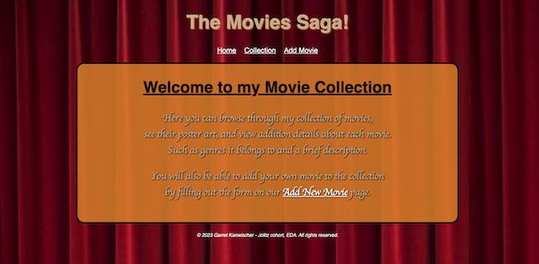
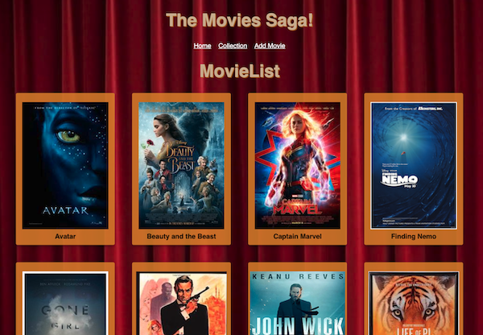
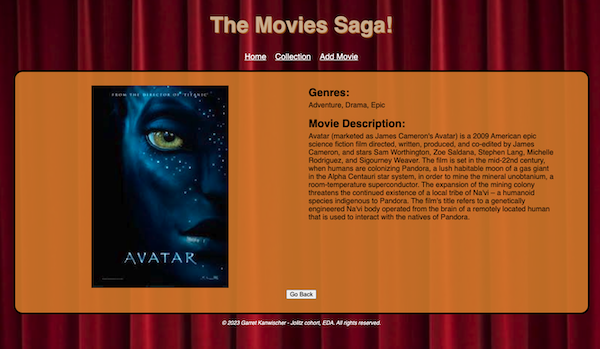
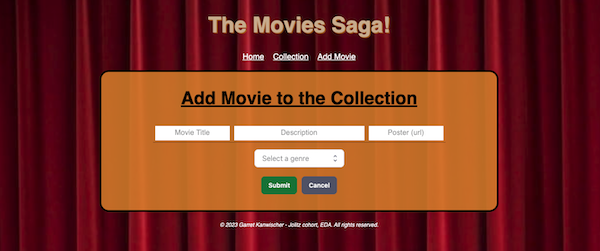

# Movie Sagas

## Description

_Duration: 3 day Weekend Challenge_

This application is built off an existing Movie App using React-Redux and Redux-Sagas. It solves the problem of managing and displaying movie information by providing a user-friendly interface to view and interact with movie data stored in a database.

The Detail View feature enhances the app by enabling users to access detailed information about each individual movie, including its title, description, image, and associated genres. This feature follows a common pattern where users can transition from a movie list to a dedicated page displaying comprehensive details for a selected movie. The implementation of Sagas and Redux ensures smooth handling of data requests and enables the app to retrieve and display the necessary information for the Detail View. By leveraging a many-to-many relationship, through a SQL join with a junction table, the Detail View can display all the genres associated with a selected movie. I also managed to maintain the details page upon refreshing the app using React Router URL PARAMS.

Additionally, the application includes a Movie Form to allow users to input new movie details and save them to the database. When the user clicks the "Submit" button, it dispatches an action to add the new movie to the collection, including the provided details and the selected genre. After successfully adding the movie, the user is redirected to the Movie List page. If the user decides they don't want to add a new movie, clicking the cancel button redirects them back to the homepage.

Overall, the Movie Form component enhances the movie management experience by allowing users to contribute to the movie collection through a user-friendly form. These enhancements contribute to a more comprehensive and user-friendly movie management experience.

## Screen Shots

Home page example

Example of one of the movie collection page

Details page example

Add Movie form example

### Prerequisites

1. [Node.Js]https://nodejs.org/en
2. [Postresql]https://www.postgresql.org/
3. [Express]https://expressjs.com/
4. [React]https://react.dev/
5. [React-Redux]https://react-redux.js.org/
6. [React-Saga]https://redux-saga.js.org/
7. [Material-UI]https://mui.com/

## Installation

1. Create a database named `saga_movies_weekend`,
2. The query in the `database.sql` file is set up to create the necessary tables. The project is built on [Postgres](https://www.postgresql.org/download/), so you will need to make sure to have that installed. We recommend using Postico to run the querys.
3. Open up your editor of choice and run an `npm install`
4. Run `npm run server` in your terminal
5. Run `npm run client` in your terminal
6. The `npm run client` command will open up a new browser tab for you!

## Acknowledgement

Thanks to [Emerging Digital Academy](https://emergingacademy.org/) who equipped and helped me to make this application a reality. (Thank you Blaine, Mason, and Katie)